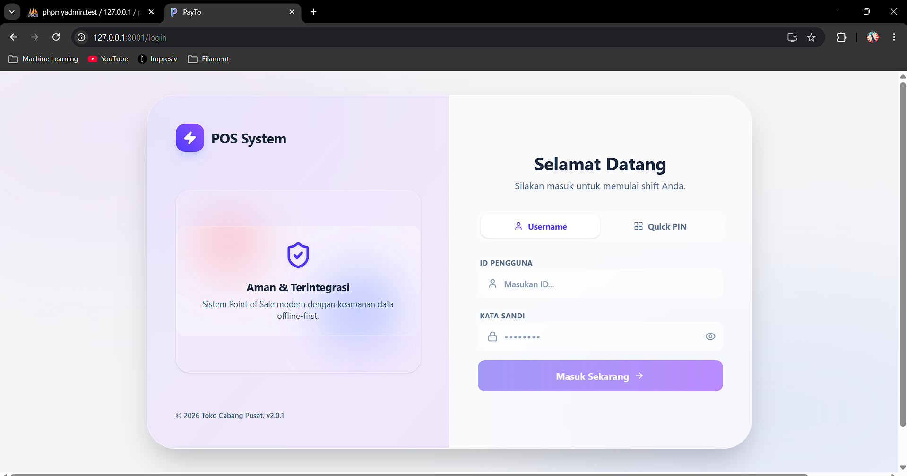

# PayTo POS

**Sistem Point of Sale modern berbasis web dengan dukungan offline dan Progressive Web App**

PayTo adalah aplikasi kasir digital yang dirancang untuk memudahkan operasional toko, warung, atau bisnis retail. Dibangun dengan teknologi web modern, PayTo dapat berjalan di browser namun tetap berfungsi seperti aplikasi native dengan kemampuan bekerja secara offline.

---

## Fitur Utama

### Untuk Kasir
- **Checkout Cepat** - Interface sederhana untuk proses transaksi yang efisien
- **Keranjang Belanja** - Tambah, ubah jumlah, dan hapus item dengan mudah
- **Pembayaran Fleksibel** - Mendukung Cash dan E-Wallet
- **Riwayat Transaksi** - Lihat semua transaksi yang telah dilakukan
- **Login dengan PIN** - Login cepat menggunakan PIN 6 digit untuk kasir

### Untuk Admin dan Supervisor
- **Dashboard Lengkap** - Ringkasan penjualan, aktivitas terbaru, dan stok menipis
- **Manajemen Produk** - CRUD produk lengkap dengan kategori dan manajemen stok
- **Rekomendasi Restock** - Saran restok otomatis berdasarkan penjualan 7 hari terakhir
- **Approval Refund** - Sistem approval untuk refund yang memerlukan persetujuan supervisor
- **Manajemen Staf** - Kelola kasir dan supervisor, termasuk reset PIN
- **Pengaturan Struk** - Kustomisasi header dan footer struk

### Teknologi Modern
- **Progressive Web App (PWA)** - Install seperti aplikasi native di perangkat apapun
- **Offline-First** - Tetap bisa bertransaksi meski internet mati
- **Auto Sync** - Transaksi offline otomatis tersinkronisasi ketika online
- **Push Notification** - Notifikasi real-time untuk approval dan update penting
- **Responsive Design** - Tampil sempurna di desktop, tablet, dan smartphone

---

## Fitur yang Akan Datang

Kami terus mengembangkan PayTo untuk memberikan pengalaman yang lebih baik. Berikut adalah fitur-fitur yang sedang dalam pengembangan:

### Guest Mode dan Katalog Online
- **Akses Tamu** - Pengunjung dapat melihat katalog produk tanpa login
- **Katalog Interaktif** - Tampilan produk dengan foto, harga, dan ketersediaan stok
- **Landing Page Dinamis** - Halaman depan yang menampilkan produk unggulan

### Integrasi WhatsApp
- **Pemesanan via WhatsApp** - Pelanggan dapat memesan produk langsung melalui WhatsApp

---

## Galeri Aplikasi

### Halaman Landing

*Halaman utama PayTo POS*

### Login

*Login dengan username/password atau PIN 6 digit*

### Dashboard Admin

*Dashboard admin dengan ringkasan penjualan dan stok*

### Interface Kasir

*Interface kasir untuk proses checkout yang cepat dan mudah*

---

## Keunggulan PayTo

| Fitur | Deskripsi |
|-------|-----------|
| **Offline-First** | Transaksi tetap berjalan tanpa internet, data tersimpan lokal dan sync otomatis |
| **Dual Authentication** | Login dengan username/password atau PIN 6 digit untuk kecepatan |
| **Role-Based Access** | Akses berbeda untuk Cashier dan Supervisor |
| **Inventory Intelligence** | Rekomendasi restock otomatis berdasarkan data penjualan |
| **Approval Workflow** | Sistem approval untuk transaksi refund |
| **Work Time Tracking** | Otomatis mencatat jam kerja kasir |
| **Cross-Platform** | Berjalan di Windows, Mac, Linux, Android, dan iOS |

---

## Mulai Menggunakan PayTo

### Untuk Pengguna

1. **Akses Aplikasi** - Buka aplikasi PayTo di browser atau install sebagai PWA
2. **Login** - Masuk menggunakan username/password atau PIN yang diberikan admin
3. **Mulai Transaksi** - Pilih produk, masukkan ke keranjang, dan checkout
4. **Offline Mode** - Jika internet mati, transaksi tetap tercatat dan akan sync otomatis

### Untuk Developer

Ingin mengembangkan atau berkontribusi pada PayTo? Lihat dokumentasi lengkap kami:

**[Dokumentasi Lengkap](docs/index.md)** - Panduan instalasi, API reference, dan arsitektur sistem

Dokumentasi mencakup:
- **Tutorial** - Panduan step-by-step untuk developer baru
- **How-to Guides** - Panduan untuk tugas-tugas spesifik
- **API Reference** - Dokumentasi lengkap 41 API endpoints
- **Explanation** - Penjelasan mendalam tentang arsitektur dan konsep sistem

---

## Teknologi yang Digunakan

- **Backend**: Laravel 12 (PHP 8.2+)
- **Frontend**: React 19 + Inertia.js v2
- **Styling**: Tailwind CSS v4
- **Database**: MySQL
- **PWA**: Service Worker + Web App Manifest
- **Push Notifications**: Web Push API (VAPID)
- **Offline Storage**: IndexedDB

---

## Lisensi

Aplikasi PayTo POS menggunakan lisensi MIT. Lihat file [LICENSE](LICENSE) untuk detail.

---

## Kontribusi

Kontribusi sangat diterima! Silakan baca panduan kontribusi kami di:

**[Panduan Kontribusi](docs/index.md)** - Cara berkontribusi pada kode sumber

---

## Dukungan

Jika Anda memiliki pertanyaan, menemukan bug, atau ingin meminta fitur baru:

**[Dokumentasi Dukungan](docs/index.md)** - Panduan pelaporan isu dan dukungan

---

Dibuat dengan Laravel dan React.
