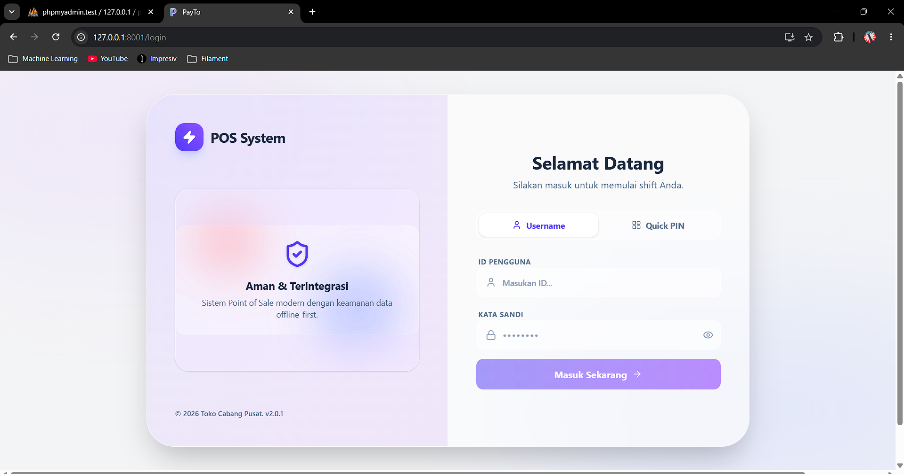

# PayTo - Sistem POS (Point of Sale) untuk Homestay & Kos

[](https://github.com/PayTo-cahayaRasa/PayTo/actions/workflows/ci.yml)
[](https://laravel.com)
[](https://react.dev)
[](https://www.php.net)

Sistem Point of Sale (POS) untuk homestay dan kos dengan fitur checkout, inventory management, dan approval workflow.

---

## Preview Aplikasi

### Halaman Login



### Interface Kasir


### Interface Admin


---

## Fitur Utama

- **Kasir (POS) Interface** - Halaman kasir untuk proses checkout
- **Admin Dashboard** - Manajemen produk, stok, dan approval
- **Checkout System** - Proses penjualan dengan multi-payment support
- **Inventory Management** - Track stok produk dan alert
- **Refund System** - Proses refund dengan approval workflow
- **Staff Management** - Kelola kasir dan supervisor
- **Product Audit** - Log perubahan produk

## Tech Stack

- **Backend**: Laravel 12.51.0 (PHP 8.2+)
- **Frontend**: Inertia.js v2 + React 19
- **Database**: MySQL 8.0+ (database: `paytocahaya`)
- **Styling**: Tailwind CSS v4
- **Testing**: PHPUnit 12
- **MCP**: laravel/mcp untuk AI-assisted development

## Persyaratan

- PHP 8.2 atau lebih tinggi
- Composer
- Node.js 20+
- MySQL 8.0+ (XAMPP/WAMP)
- Database harus running untuk development

## Cara Install

```bash
# Clone repository
git clone https://github.com/PayTo-cahayaRasa/PayTo.git
cd PayTo

# Install dependencies
make install

# Setup environment
cp .env.example .env
php artisan key:generate

# Setup database (butuh MySQL running)
php artisan migrate --seed

# Build frontend
npm run build

# Start development
make dev
```

## Perintah Development

```bash
# Install dependencies
make install

# Development server
make dev

# Run tests
make test

# Fix code style (Pint)
make pint

# Run all CI checks
make ci
```

## Struktur Project

```
PayTo/
├── app/
│   ├── Enums/           # Enum definitions (TitleCase keys)
│   ├── Http/
│   │   ├── Controllers/
│   │   │   ├── Api/    # API controllers
│   │   │   ├── Auth/   # Auth controllers
│   │   │   └── Pos/    # POS page controllers
│   │   ├── Middleware/ # Auth, role, throttle
│   │   └── Requests/   # Form request validation
│   ├── Models/         # Eloquent models
│   └── Services/       # Business logic
├── resources/
│   └── js/
│       ├── Pages/
│       │   ├── admin/  # Admin dashboard pages
│       │   ├── kasir.tsx
│       │   └── catalog.tsx
│       └── Components/  # React components
├── routes/
│   ├── api.php        # API routes
│   └── web.php        # Web routes
└── docs/              # Documentation
```

## Roles & Permissions

| Role | Akses |
|------|-------|
| **SUPERVISOR** | Full admin access, approval workflow, staff management |
| **CASHIER** | POS interface, checkout, history |

## Routes Overview

### Web Routes
- `/login` - Login page
- `/kasir` - Kasir/POS interface
- `/admin` - Admin dashboard

### API Routes
- **Admin API** (`/api/admin/*`) - Product management, settings, staff
- **POS API** (`/api/pos/*`) - Checkout, refunds, history

## Testing

```bash
# Run all tests
php artisan test --compact

# Run specific test
php artisan test --compact --filter=CheckoutTest
```

## Dokumentasi Tambahan

- [CONTRIBUTING.md](CONTRIBUTING.md) - Panduan berkontribusi
- [docs/index.md](docs/index.md) - Struktur dokumentasi
- [docs/reference/api.md](docs/reference/api.md) - API reference
- [docs/reference/database-schema.md](docs/reference/database-schema.md) - Schema reference

## Lisensi

Private project - All rights reserved.
